# ItCol 月次作業報告ツール

プロジェクト作業時間を計測・集計し、月次レポートを作成する Web アプリケーション

[](https://www.python.org/)
[](https://flask.palletsprojects.com/)
[]()

## 📋 目次

- [概要](#概要)
- [主な機能](#主な機能)
- [システム構成](#システム構成)
- [セットアップ](#セットアップ)
- [使い方](#使い方)
- [データベース構造](#データベース構造)
- [技術スタック](#技術スタック)

## 🎯 概要

IT 業務における作業実績を日々記録し、月次で集計・報告するための Web アプリケーションです。タスク単位での作業時間の正確な計測と、プロジェクト・カテゴリ別の自動集計により、効率的な作業報告を実現します。

### アプリケーションフロー

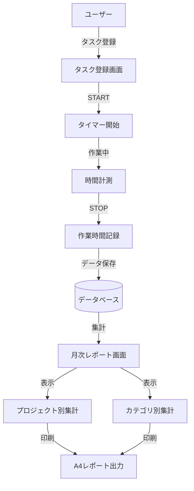

### ユースケース図

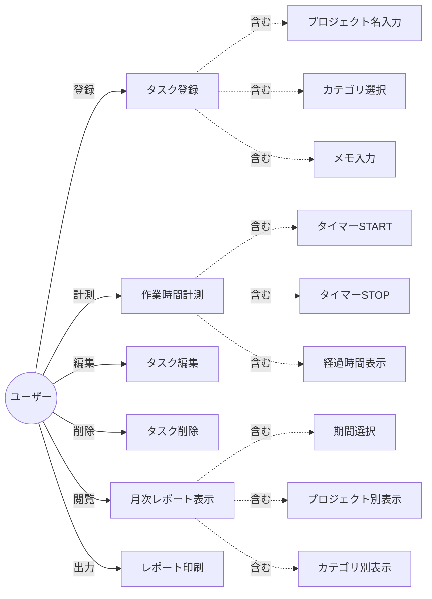

## ✨ 主な機能

### M-1. タスク登録フォーム ✅

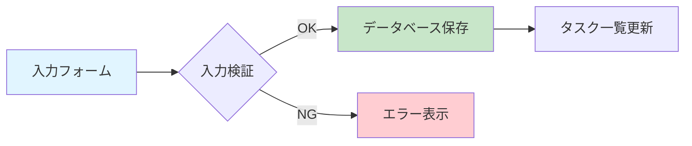

- **プロジェクト名**: 必須入力、最大 100 文字
- **カテゴリ選択**: プルダウン（開発、会議、メール、調査、その他）
- **メモ**: 任意入力、最大 500 文字

### M-2. タイマー機能 ✅

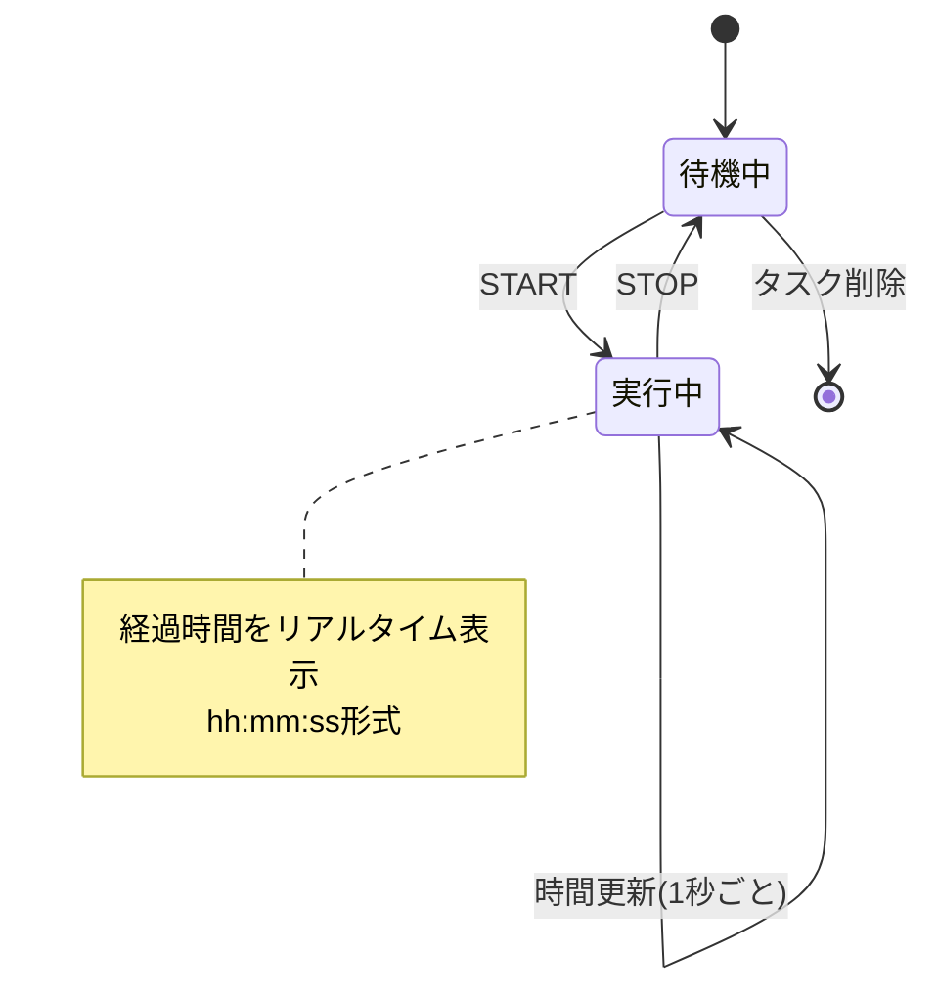

- **START/STOP ボタン**: 作業時間の計測開始・停止
- **経過時間表示**: リアルタイムで時間表示（hh:mm:ss 形式）
- **データ記録**: 開始時刻、終了時刻、作業時間（秒単位）を DB に保存

### M-3. 月次集計機能 ✅

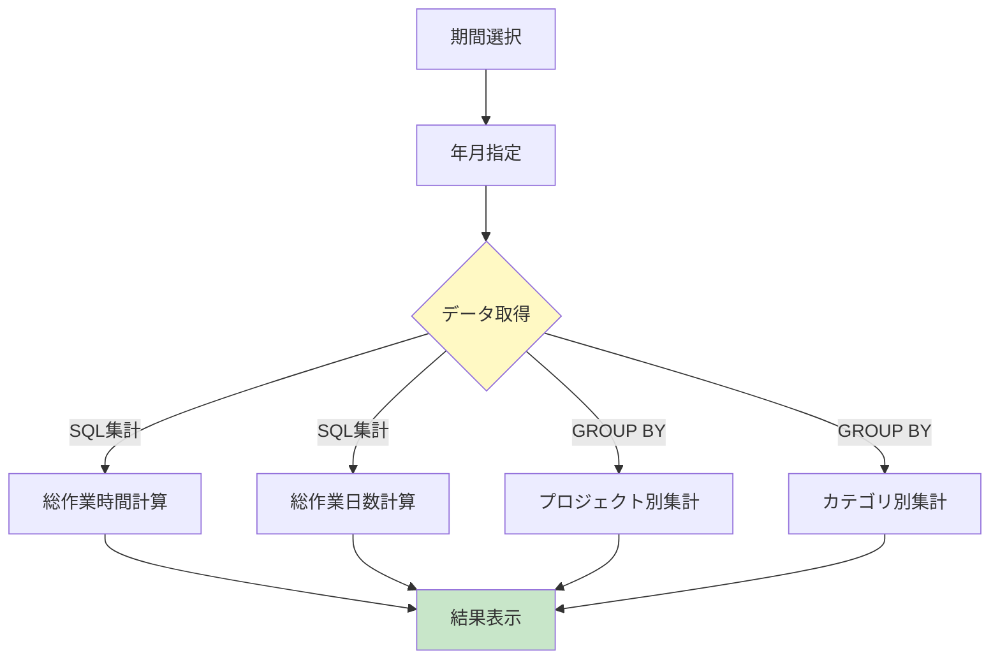

- **集計期間選択**: 年月をプルダウンで選択
- **総作業時間表示**: 選択月の総作業時間（h 単位、小数点 1 桁）
- **総作業日数表示**: 選択月の実働日数

### M-4/M-5. プロジェクト別・カテゴリ別一覧 ✅

| 項目       | 説明                                           |
| ---------- | ---------------------------------------------- |
| 表示項目   | プロジェクト名/カテゴリ名、作業時間、割合（%） |
| ソート     | 作業時間の降順                                 |
| レイアウト | A4 縦印刷対応テーブル                          |

### M-6. 印刷対応（CSS） ✅

- `@media print` を使用した印刷専用 CSS
- A4 縦サイズでページ内に収まるレイアウト
- 不要要素（ボタン、ナビゲーション）を自動非表示

## 🏗️ システム構成

### システムアーキテクチャ

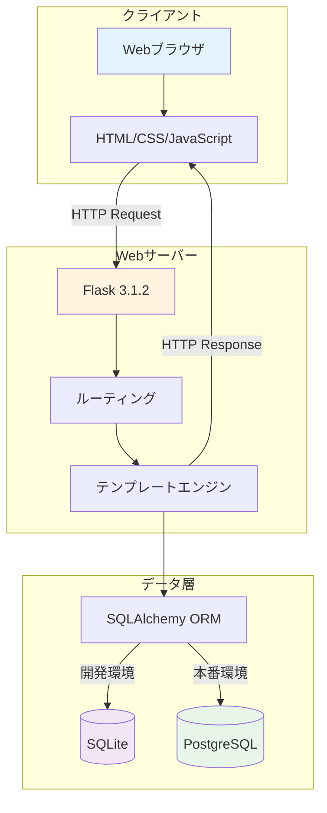

### ディレクトリ構造

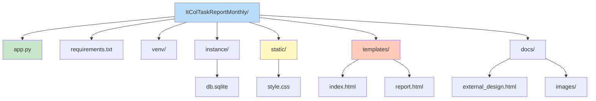

## 🚀 セットアップ

### 前提条件

- Python 3.8 以上
- pip
- (オプション) PostgreSQL 12 以上

### インストール手順

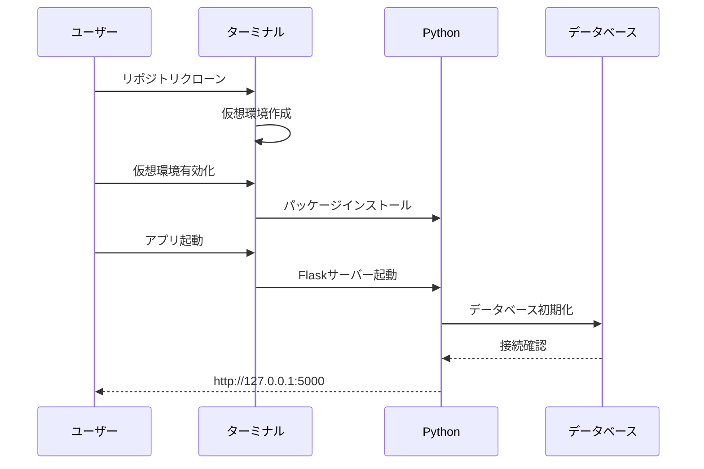

### 1. リポジトリのクローン

```bash
git clone https://github.com/itc-s24011/ItColTaskReportMonthly.git
cd ItColTaskReportMonthly/ItColTaskReportMonthly/ItColTaskReportMonthly
```

### 2. 仮想環境のセットアップ

```bash
# 仮想環境を作成
python3 -m venv venv

# 仮想環境を有効化
source venv/bin/activate  # Linux/Mac
# または
venv\Scripts\activate     # Windows
```

### 3. 依存パッケージのインストール

```bash
pip install -r requirements.txt
```

### 4. アプリケーションの起動

```bash
# SQLiteを使用（デフォルト）
python3 app.py

# PostgreSQLを使用
export USE_POSTGRESQL=1  # Linux/Mac
# または
set USE_POSTGRESQL=1     # Windows
python3 app.py
```

### 5. ブラウザでアクセス

```
http://127.0.0.1:5000
```

## 📖 使い方

### タスク登録から報告までの流れ

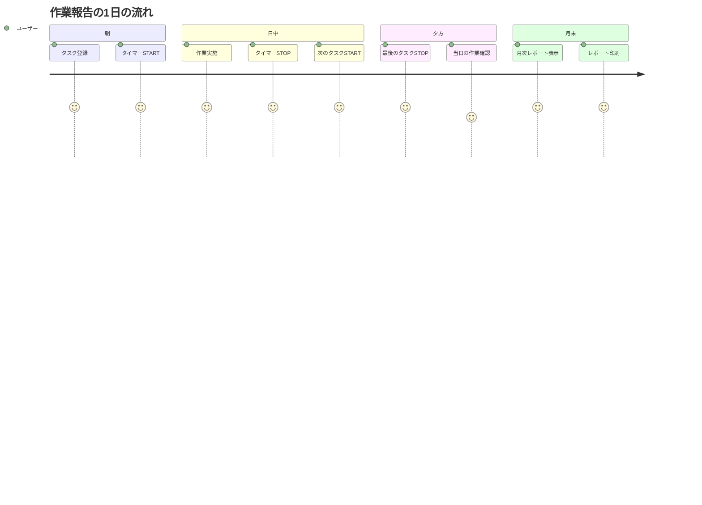

### タスク登録・実行画面

1. **新規タスク登録**

   - プロジェクト名を入力
   - カテゴリを選択（開発、会議、メール、調査、その他）
   - メモを入力（任意）
   - 「タスクを追加」ボタンをクリック

2. **タイマーの操作**

   - **START**: タスクの作業時間計測を開始
   - **STOP**: 作業時間計測を停止
   - 経過時間はリアルタイムで更新されます

3. **タスクの編集・削除**
   - **編集**: タスク情報を変更
   - **削除**: タスクを削除（確認ダイアログが表示されます）

### 月次レポート画面

1. **期間選択**

   - 年と月をプルダウンから選択
   - 自動的に集計結果が更新されます

2. **表示切替**

   - **プロジェクト別**: プロジェクトごとの作業時間を表示
   - **カテゴリ別**: カテゴリごとの作業時間を表示

3. **印刷**
   - 「印刷」ボタンをクリック
   - A4 縦サイズで印刷プレビューが表示されます

## 🗄️ データベース構造

### ERD（Entity Relationship Diagram）

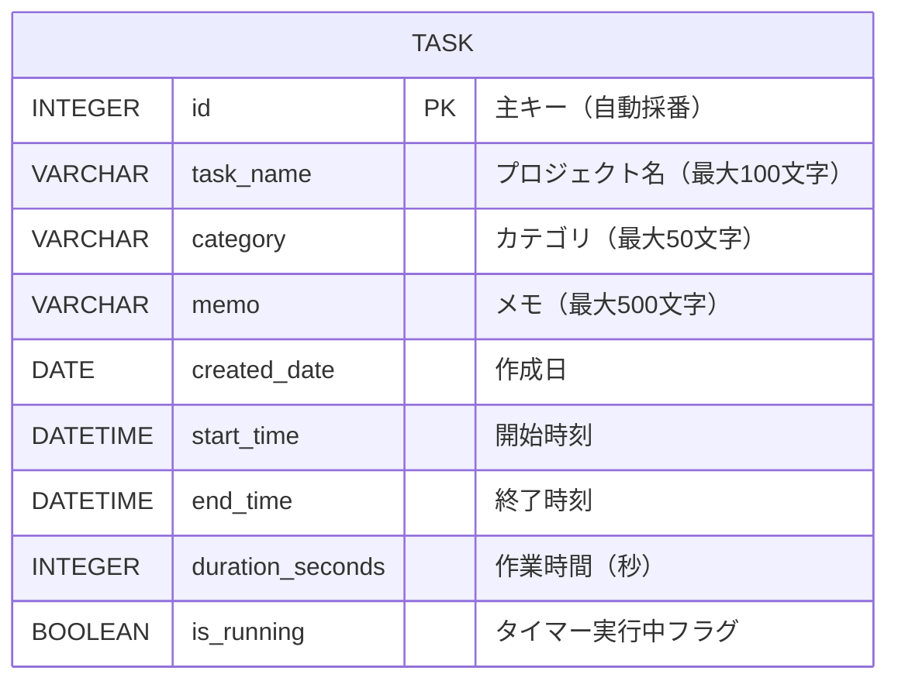

### カテゴリマスタ

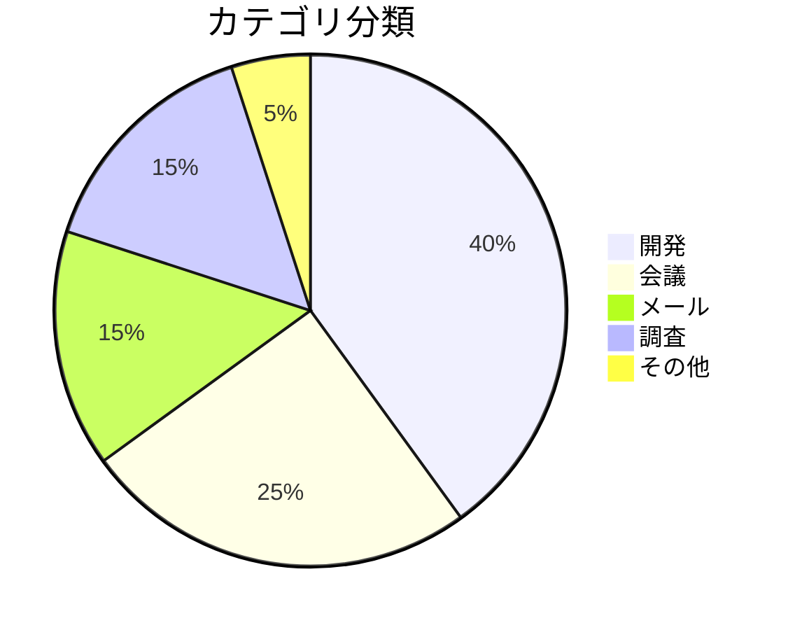

### Task テーブル詳細

| カラム名         | 型           | NULL | 説明                 |
| ---------------- | ------------ | ---- | -------------------- |
| id               | INTEGER      | NO   | 主キー（自動採番）   |
| task_name        | VARCHAR(100) | NO   | プロジェクト名       |
| category         | VARCHAR(50)  | NO   | カテゴリ             |
| memo             | VARCHAR(500) | YES  | メモ                 |
| created_date     | DATE         | NO   | 作成日               |
| start_time       | DATETIME     | YES  | 開始時刻             |
| end_time         | DATETIME     | YES  | 終了時刻             |
| duration_seconds | INTEGER      | YES  | 作業時間（秒単位）   |
| is_running       | BOOLEAN      | NO   | タイマー実行中フラグ |

## 🔧 技術スタック

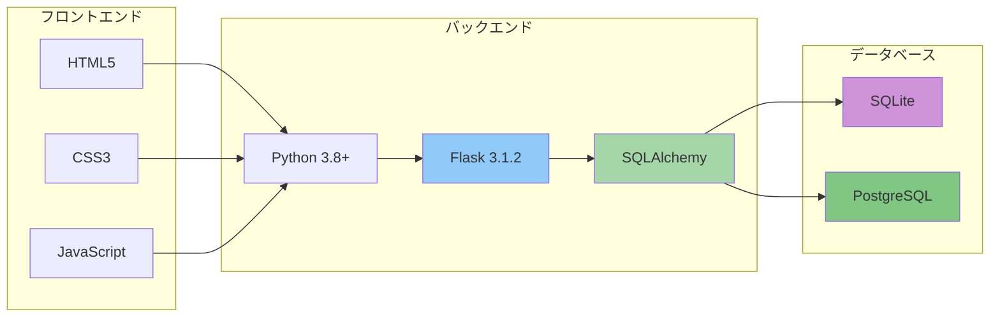

### 使用技術一覧

| カテゴリ           | 技術                    | バージョン |
| ------------------ | ----------------------- | ---------- |
| 言語               | Python                  | 3.8+       |
| Web フレームワーク | Flask                   | 3.1.2      |
| ORM                | SQLAlchemy              | 2.0+       |
| データベース       | SQLite / PostgreSQL     | -          |
| フロントエンド     | HTML5, CSS3, JavaScript | -          |
| その他             | psycopg2-binary         | 2.9+       |

## 🎨 デザイン特徴

### カラーパレット

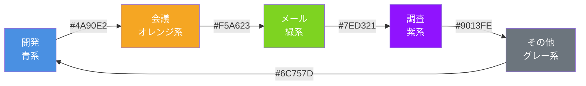

- **モダンなグラデーション**: 紫系のグラデーション背景
- **レスポンシブデザイン**: モバイル・タブレット・デスクトップに対応
- **カテゴリカラー**: カテゴリごとに色分け
- **印刷最適化**: A4 縦サイズで綺麗に印刷可能

## 🐛 トラブルシューティング

### よくある問題と解決方法

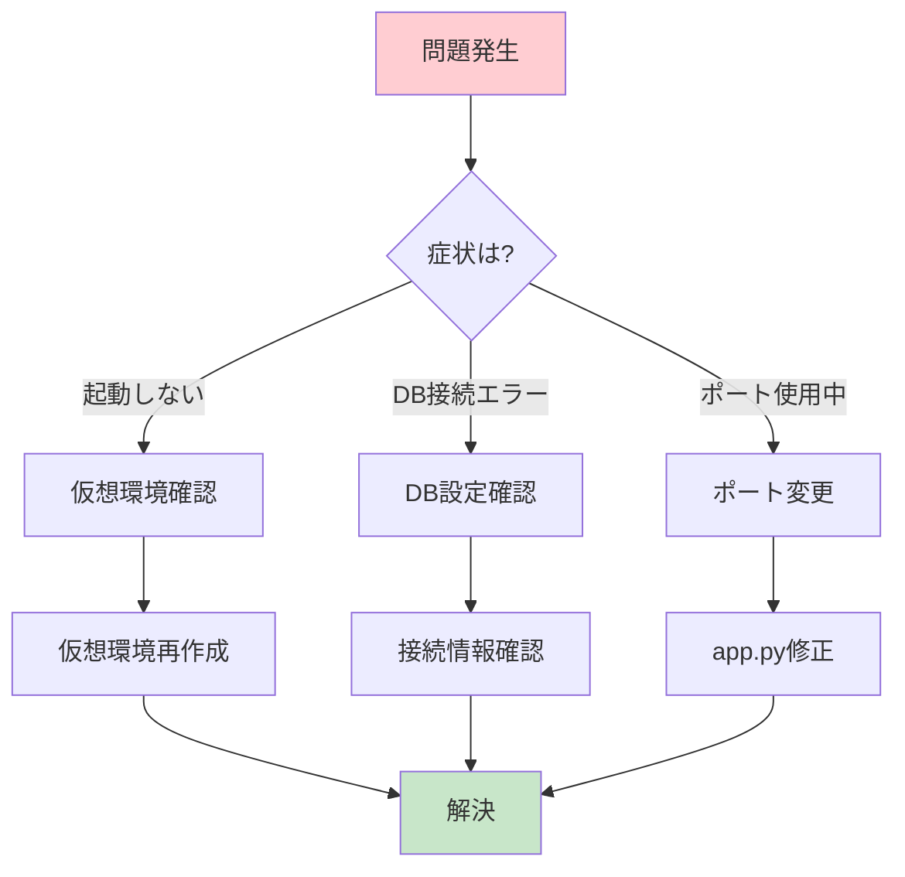

### Flask が起動しない

```bash
# 仮想環境を再作成
rm -rf venv
python3 -m venv venv
source venv/bin/activate
pip install -r requirements.txt
```

### データベースをリセットしたい

```bash
rm -f instance/db.sqlite
python3 app.py  # 再起動時に自動作成
```

### ポート 5000 が使用中

```python
# app.py の最後の行を変更
app.run(debug=True, port=5001)
```

## 📊 開発情報

### 開発体制

- **対象者**: IT 専門学生 6 名
- **開発期間**: 9 時間（1 日）
- **合計工数**: 54 人時間

### 開発の流れ

```mermaid
gantt
    title 開発スケジュール
    dateFormat HH:mm
    axisFormat %H:%M

    section 設計
    要件定義        :done, 09:00, 1h
    画面設計        :done, 10:00, 1h

    section 実装
    データベース    :done, 11:00, 2h
    バックエンド    :done, 13:00, 2h
    フロントエンド  :done, 15:00, 2h

    section テスト
    動作確認        :done, 17:00, 1h
```

## 📄 ライセンス

このプロジェクトは教育目的で作成されています。

## 🤝 コントリビューション

バグ報告や機能リクエストは、GitHub の Issues でお願いします。

## 📞 サポート

問題が発生した場合は、以下を確認してください：

1. [トラブルシューティング](#トラブルシューティング)
2. GitHub Issues
3. 開発チームへの連絡

---

**作成日**: 2025 年 12 月 15 日  
**最終更新**: 2026 年 1 月 19 日  
**バージョン**: 1.1.0  
**開発**: IT 専門学生 6 名による共同開発プロジェクト
