<div align="center">

# ItCol 月次作業報告システム

### エンタープライズグレードの時間追跡・レポートシステム

[](https://www.python.org/)
[](https://flask.palletsprojects.com/)
[](https://www.sqlalchemy.org/)
[](https://www.postgresql.org/)
[]()

</div>

---

## 目次

- [概要](#概要)
- [主要機能](#主要機能)
- [システムアーキテクチャ](#システムアーキテクチャ)
- [インストール](#インストール)
- [使用方法](#使用方法)
- [データベーススキーマ](#データベーススキーマ)
- [技術スタック](#技術スタック)
- [開発情報](#開発情報)

---

## 概要

> プロジェクトの作業時間を精密なタイミングとインテリジェントな分類で追跡、集計、レポートする包括的な Web アプリケーション

正確な時間追跡と楽な月次レポート作成を求める IT プロフェッショナルのために構築されました。このシステムは、リアルタイムのタスク監視、プロジェクトおよびカテゴリ別の自動集計、ステークホルダー向けのプロフェッショナルな A4 フォーマットレポートを提供します。

### アプリケーションフロー

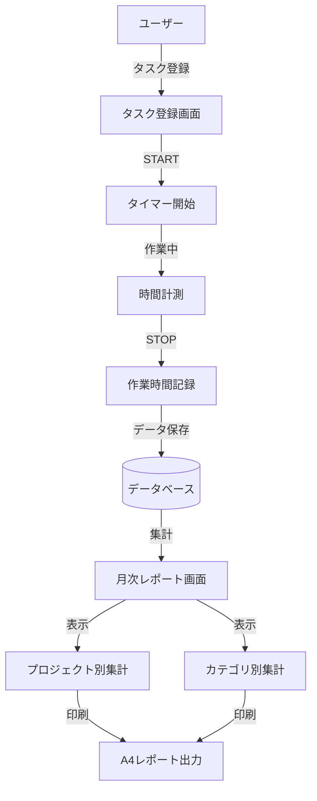

### ユースケース図

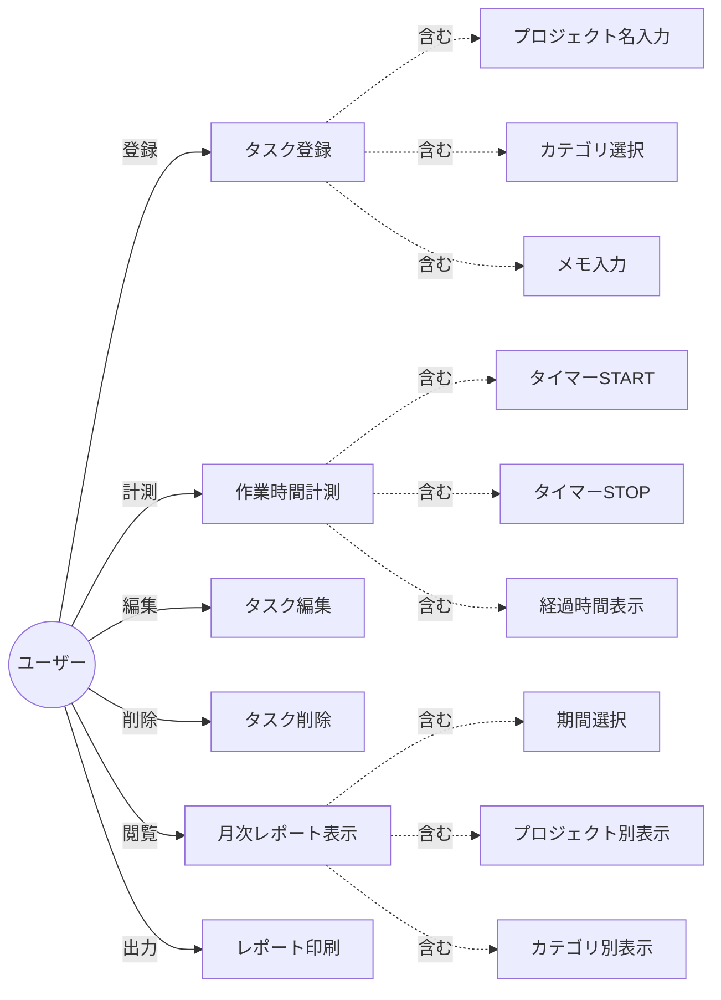

---

## 主要機能

### モジュール 1: タスク登録システム

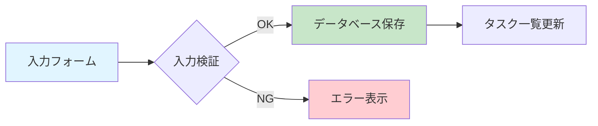

**Key Specifications:**

- **Project Name**: Required field, max 100 characters
- **Category Selection**: Dropdown (Development, Meeting, Email, Research, Other)
- **Memo Field**: Optional, max 500 characters
- **Validation**: Real-time input validation with user feedback

### MODULE 2: Precision Timer System

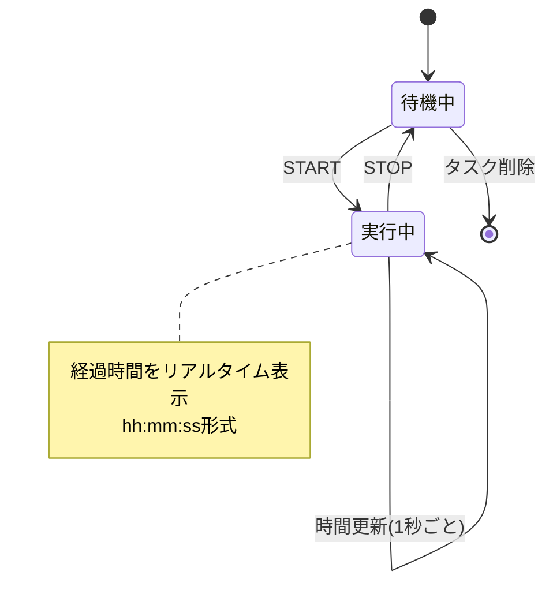

**Key Specifications:**

- **START/STOP Controls**: Initiate and terminate time tracking with single-click precision
- **Live Display**: Real-time elapsed time in hh:mm:ss format with 1-second refresh
- **Data Persistence**: Automatic storage of start time, end time, and duration (in seconds)
- **State Management**: Maintains timer state across sessions

### MODULE 3: Monthly Aggregation Engine

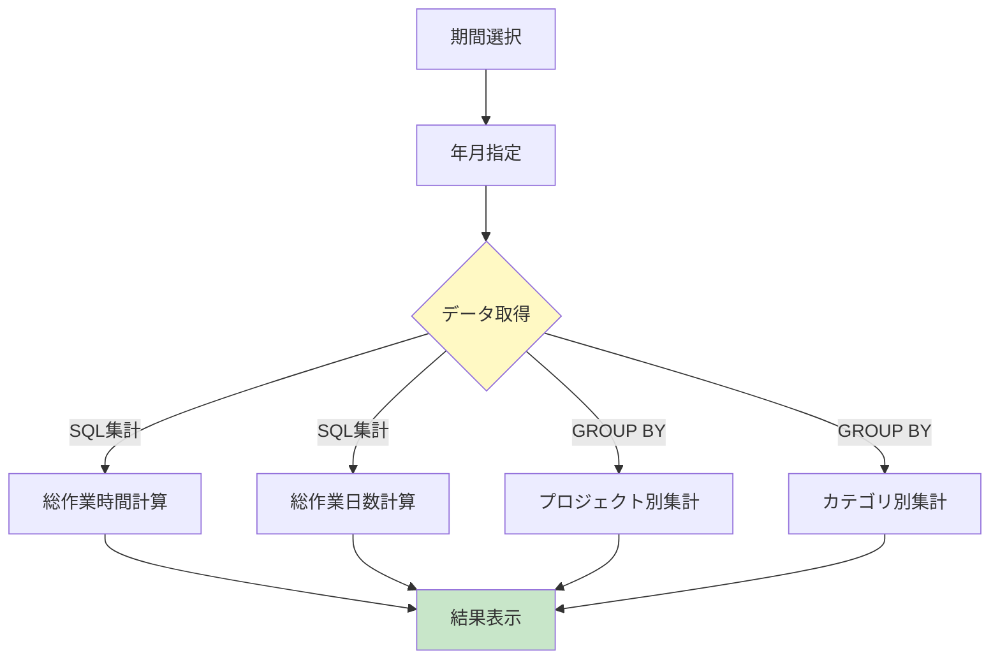

**Key Specifications:**

- **Period Selection**: Year and month dropdown selectors with dynamic filtering
- **Total Hours Display**: Aggregate work hours (decimal format, 1 decimal place)
- **Working Days Count**: Total active working days in selected period
- **SQL Optimization**: Efficient GROUP BY and SUM queries for fast aggregation

### MODULE 4/5: Project & Category Analytics

| Feature             | Description                                                |
| ------------------- | ---------------------------------------------------------- |
| **Display Metrics** | Project/Category name, work hours, percentage distribution |
| **Sorting**         | Descending order by work hours (highest priority first)    |
| **Layout**          | A4 portrait-optimized table with responsive design         |
| **Visualization**   | Horizontal bar charts for percentage representation        |

### MODULE 6: Print-Optimized CSS System

**Key Specifications:**

- `@media print` dedicated stylesheet for professional output
- A4 portrait layout with optimized margins and spacing
- Automatic removal of interactive elements (buttons, navigation)
- High-contrast color scheme for clear printed output

---

## システムアーキテクチャ

### アーキテクチャ概要

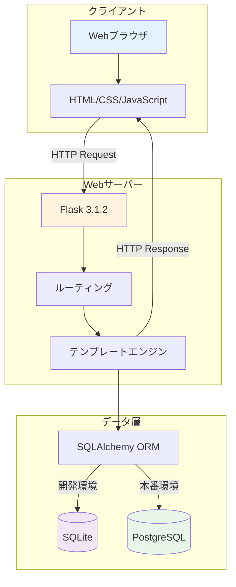

### ディレクトリ構造

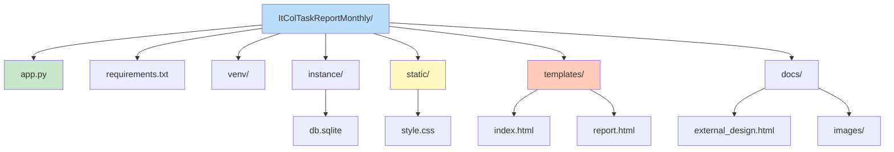

---

## インストール

### 前提条件

```bash
# 必須
Python 3.8+
pip (最新版)

# オプション（本番環境用）
PostgreSQL 12+
Docker (コンテナ化デプロイ用)
```

### インストールワークフロー

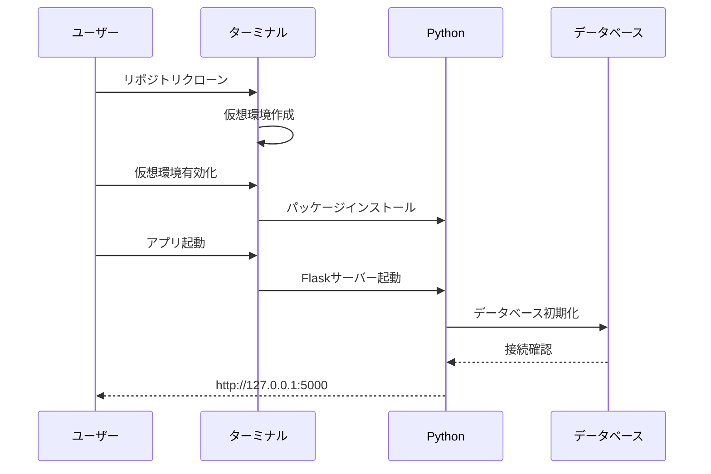

#### ステップ 1: リポジトリのクローン

```bash
git clone https://github.com/itc-s24011/ItColTaskReportMonthly.git
cd ItColTaskReportMonthly/ItColTaskReportMonthly/ItColTaskReportMonthly
```

#### ステップ 2: 仮想環境のセットアップ

```bash
# 仮想環境を作成
python3 -m venv venv

# 仮想環境を有効化
source venv/bin/activate  # Linux/Mac
venv\Scripts\activate     # Windows
```

#### ステップ 3: 依存関係のインストール

```bash
pip install -r requirements.txt
```

#### ステップ 4: アプリケーションの起動

```bash
# SQLiteを使用した開発モード（デフォルト）
python3 app.py

# PostgreSQLを使用した本番モード
export USE_POSTGRESQL=1  # Linux/Mac
set USE_POSTGRESQL=1     # Windows
python3 app.py
```

#### ステップ 5: アプリケーションへのアクセス

```
http://127.0.0.1:5000
```

---

## 使用方法

### 日次ワークフロー

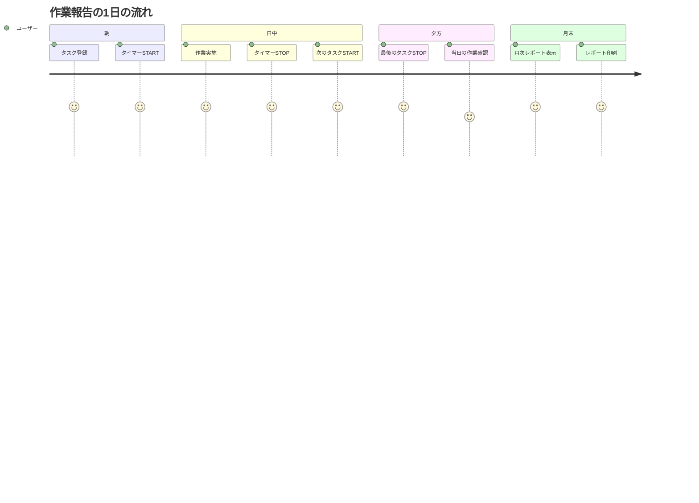

### TASK REGISTRATION & EXECUTION

**1. Create New Task**

- Enter project name (required)
- Select category from dropdown (Development, Meeting, Email, Research, Other)
- Add optional memo (max 500 characters)
- Click "Add Task" button

**2. Timer Operations**

- **START**: Begin time tracking for selected task
- **STOP**: End time tracking and save duration
- **Live Updates**: Elapsed time refreshes every second

**3. Task Management**

- **Edit**: Modify task information in-place
- **Delete**: Remove task with confirmation dialog

### MONTHLY REPORT GENERATION

**1. Period Selection**

- Choose year and month from dropdowns
- Results update automatically on selection

**2. View Toggle**

- **Project View**: Aggregated hours by project
- **Category View**: Aggregated hours by category
- Switch between views with single click

**3. Report Export**

- Click "Print" button for print preview
- A4 portrait layout with professional formatting
- Save as PDF or print directly

---

## データベーススキーマ

### エンティティ関連図

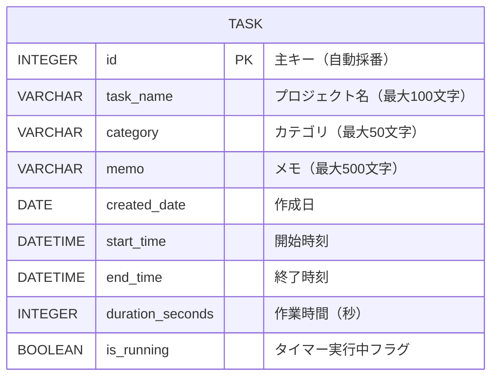

### カテゴリ分布

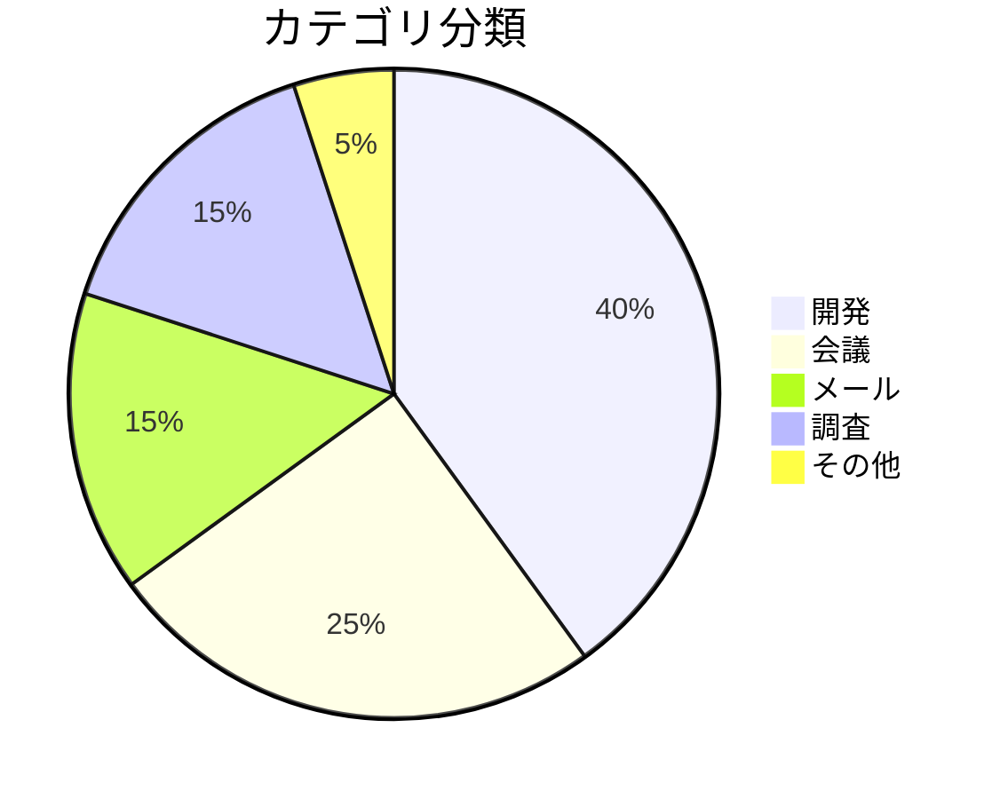

### TASK テーブル仕様

| カラム名         | 型           | NULL 許可 | 説明                       |
| ---------------- | ------------ | --------- | -------------------------- |
| id               | INTEGER      | NO        | 主キー（自動採番）         |
| task_name        | VARCHAR(100) | NO        | プロジェクト識別子         |
| category         | VARCHAR(50)  | NO        | タスクカテゴリ             |
| memo             | VARCHAR(500) | YES       | オプションメモ             |
| created_date     | DATE         | NO        | 作成タイムスタンプ         |
| start_time       | DATETIME     | YES       | タイマー開始タイムスタンプ |
| end_time         | DATETIME     | YES       | タイマー終了タイムスタンプ |
| duration_seconds | INTEGER      | YES       | 総継続時間（秒）           |
| is_running       | BOOLEAN      | NO        | タイマー稼働フラグ         |

---

## 技術スタック

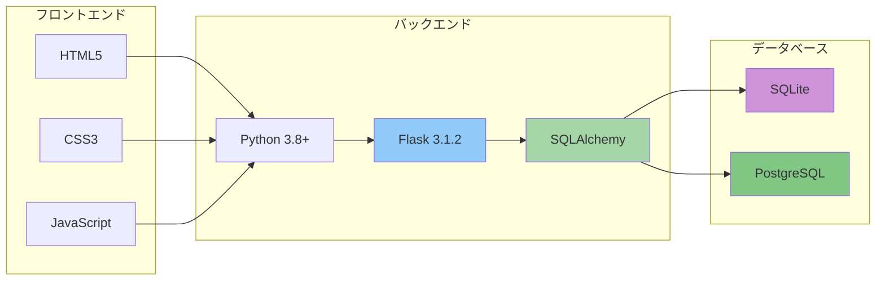

### スタックコンポーネント

| レイヤー                 | 技術                         | バージョン |
| ------------------------ | ---------------------------- | ---------- |
| **言語**                 | Python                       | 3.8+       |
| **Web フレームワーク**   | Flask                        | 3.1.2      |
| **ORM**                  | SQLAlchemy                   | 2.0+       |
| **データベース**         | SQLite / PostgreSQL          | 12+        |
| **フロントエンド**       | HTML5, CSS3, JavaScript ES6+ | -          |
| **データベースドライバ** | psycopg2-binary              | 2.9+       |
| **セッション管理**       | Flask-SQLAlchemy             | 3.1+       |

---

## デザインシステム

### カラーパレット

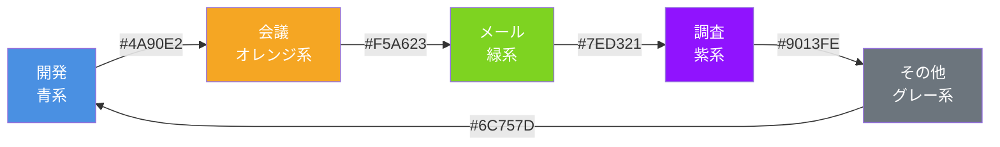

**Design Principles:**

- **Modern Gradient System**: Purple-based gradient backgrounds for visual hierarchy
- **Fully Responsive**: Optimized layouts for mobile, tablet, and desktop viewports
- **Category Color Coding**: Distinct color scheme for instant category recognition
- **Print Optimization**: Professional A4 portrait layout with high-contrast printing

---

## トラブルシューティング

### よくある問題と解決策

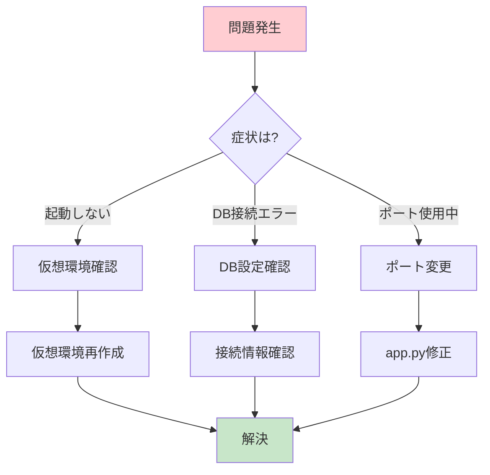

**問題: Flask が起動しない**

```bash
# 仮想環境を再構築
rm -rf venv
python3 -m venv venv
source venv/bin/activate
pip install -r requirements.txt
```

**問題: データベースの破損またはリセットが必要**

```bash
# 既存のデータベースを削除
rm -f instance/db.sqlite
python3 app.py  # 起動時に自動的に再作成
```

**問題: ポート 5000 が既に使用中**

```python
# app.pyを編集 - ポート番号を変更
app.run(debug=True, port=5001)
```

---

## 開発情報

### プロジェクトメトリクス

```
チームサイズ:   6名の開発者
期間:          9時間（1日スプリント）
総工数:        54人時
方法論:        ラピッドプロトタイピングを伴うアジャイル開発
```

### 開発タイムライン

```mermaid
gantt
    title 開発スケジュール
    dateFormat HH:mm
    axisFormat %H:%M

    section 設計
    要件定義        :done, 09:00, 1h
    画面設計        :done, 10:00, 1h

    section 実装
    データベース    :done, 11:00, 2h
    バックエンド    :done, 13:00, 2h
    フロントエンド  :done, 15:00, 2h

    section テスト
    動作確認        :done, 17:00, 1h
```

---

## ライセンス

このプロジェクトは教育目的で作成されています。

## コントリビューション

バグ報告や機能リクエストは、GitHub Issues で歓迎します。

## サポート

サポートが必要な場合は、以下を参照してください:

1. [トラブルシューティングガイド](#トラブルシューティング)
2. [GitHub Issues](https://github.com/itc-s24011/ItColTaskReportMonthly/issues)
3. 開発チームへの連絡

---

<div align="center">

### プロジェクト情報

**作成日:** 2025 年 12 月 15 日  
**最終更新:** 2026 年 1 月 19 日  
**バージョン:** 1.1.0

**開発チーム:** IT 専門学生（6 名）

---

_精密に構築。プロフェッショナルのために設計。_

</div>
