<div align="center">

# ItCol Task Report Monthly

### Enterprise-Grade Time Tracking & Reporting System

[](https://www.python.org/)
[](https://flask.palletsprojects.com/)
[](https://www.sqlalchemy.org/)
[](https://www.postgresql.org/)
[]()

</div>

---

## TABLE OF CONTENTS

- [OVERVIEW](#overview)
- [CORE FEATURES](#core-features)
- [SYSTEM ARCHITECTURE](#system-architecture)
- [INSTALLATION](#installation)
- [USAGE](#usage)
- [DATABASE SCHEMA](#database-schema)
- [TECHNOLOGY STACK](#technology-stack)
- [DEVELOPMENT](#development)

---

## OVERVIEW

> A comprehensive web application for tracking, aggregating, and reporting project work hours with precision timing and intelligent categorization.

Built for IT professionals who demand accurate time tracking and effortless monthly reporting. This system provides real-time task monitoring, automated aggregation by project and category, and professional A4-formatted reports ready for stakeholder presentation.

### APPLICATION FLOW

```mermaid
graph TD
    A[ユーザー] -->|タスク登録| B[タスク登録画面]
    B -->|START| C[タイマー開始]
    C -->|作業中| D[時間計測]
    D -->|STOP| E[作業時間記録]
    E -->|データ保存| F[(データベース)]
    F -->|集計| G[月次レポート画面]
    G -->|表示| H[プロジェクト別集計]
    G -->|表示| I[カテゴリ別集計]
    H -->|印刷| J[A4レポート出力]
    I -->|印刷| J
```

### USE CASE DIAGRAM

```mermaid
graph LR
    User((ユーザー))

    User -->|登録| UC1[タスク登録]
    User -->|計測| UC2[作業時間計測]
    User -->|編集| UC3[タスク編集]
    User -->|削除| UC4[タスク削除]
    User -->|閲覧| UC5[月次レポート表示]
    User -->|出力| UC6[レポート印刷]

    UC1 -.->|含む| UC1A[プロジェクト名入力]
    UC1 -.->|含む| UC1B[カテゴリ選択]
    UC1 -.->|含む| UC1C[メモ入力]

    UC2 -.->|含む| UC2A[タイマーSTART]
    UC2 -.->|含む| UC2B[タイマーSTOP]
    UC2 -.->|含む| UC2C[経過時間表示]

    UC5 -.->|含む| UC5A[期間選択]
    UC5 -.->|含む| UC5B[プロジェクト別表示]
    UC5 -.->|含む| UC5C[カテゴリ別表示]
```

---

## CORE FEATURES

### MODULE 1: Task Registration System

```mermaid
flowchart LR
    A[入力フォーム] --> B{入力検証}
    B -->|OK| C[データベース保存]
    B -->|NG| D[エラー表示]
    C --> E[タスク一覧更新]

    style A fill:#e1f5ff
    style C fill:#c8e6c9
    style D fill:#ffcdd2
```

**Key Specifications:**

- **Project Name**: Required field, max 100 characters
- **Category Selection**: Dropdown (Development, Meeting, Email, Research, Other)
- **Memo Field**: Optional, max 500 characters
- **Validation**: Real-time input validation with user feedback

### MODULE 2: Precision Timer System

```mermaid
stateDiagram-v2
    [*] --> 待機中
    待機中 --> 実行中: START
    実行中 --> 待機中: STOP
    実行中 --> 実行中: 時間更新(1秒ごと)
    待機中 --> [*]: タスク削除

    note right of 実行中
        経過時間をリアルタイム表示
        hh:mm:ss形式
    end note
```

**Key Specifications:**

- **START/STOP Controls**: Initiate and terminate time tracking with single-click precision
- **Live Display**: Real-time elapsed time in hh:mm:ss format with 1-second refresh
- **Data Persistence**: Automatic storage of start time, end time, and duration (in seconds)
- **State Management**: Maintains timer state across sessions

### MODULE 3: Monthly Aggregation Engine

```mermaid
graph TD
    A[期間選択] --> B[年月指定]
    B --> C{データ取得}
    C -->|SQL集計| D[総作業時間計算]
    C -->|SQL集計| E[総作業日数計算]
    C -->|GROUP BY| F[プロジェクト別集計]
    C -->|GROUP BY| G[カテゴリ別集計]

    D --> H[結果表示]
    E --> H
    F --> H
    G --> H

    style C fill:#fff9c4
    style H fill:#c8e6c9
```

**Key Specifications:**

- **Period Selection**: Year and month dropdown selectors with dynamic filtering
- **Total Hours Display**: Aggregate work hours (decimal format, 1 decimal place)
- **Working Days Count**: Total active working days in selected period
- **SQL Optimization**: Efficient GROUP BY and SUM queries for fast aggregation

### MODULE 4/5: Project & Category Analytics

| Feature             | Description                                                |
| ------------------- | ---------------------------------------------------------- |
| **Display Metrics** | Project/Category name, work hours, percentage distribution |
| **Sorting**         | Descending order by work hours (highest priority first)    |
| **Layout**          | A4 portrait-optimized table with responsive design         |
| **Visualization**   | Horizontal bar charts for percentage representation        |

### MODULE 6: Print-Optimized CSS System

**Key Specifications:**

- `@media print` dedicated stylesheet for professional output
- A4 portrait layout with optimized margins and spacing
- Automatic removal of interactive elements (buttons, navigation)
- High-contrast color scheme for clear printed output

---

## SYSTEM ARCHITECTURE

### ARCHITECTURE OVERVIEW

```mermaid
graph TB
    subgraph クライアント
        A[Webブラウザ]
        B[HTML/CSS/JavaScript]
    end

    subgraph Webサーバー
        C[Flask 3.1.2]
        D[ルーティング]
        E[テンプレートエンジン]
    end

    subgraph データ層
        F[SQLAlchemy ORM]
        G[(SQLite)]
        H[(PostgreSQL)]
    end

    A --> B
    B -->|HTTP Request| C
    C --> D
    D --> E
    E --> F
    F -->|開発環境| G
    F -->|本番環境| H
    E -->|HTTP Response| B

    style A fill:#e3f2fd
    style C fill:#fff3e0
    style G fill:#f3e5f5
    style H fill:#e8f5e9
```

### DIRECTORY STRUCTURE


---

## INSTALLATION

### PREREQUISITES

```bash
# Required
Python 3.8+
pip (latest version)

# Optional (Production)
PostgreSQL 12+
Docker (for containerized deployment)
```

### INSTALLATION WORKFLOW

```mermaid
sequenceDiagram
    participant U as ユーザー
    participant T as ターミナル
    participant P as Python
    participant D as データベース

    U->>T: リポジトリクローン
    T->>T: 仮想環境作成
    U->>T: 仮想環境有効化
    T->>P: パッケージインストール
    U->>T: アプリ起動
    T->>P: Flaskサーバー起動
    P->>D: データベース初期化
    D-->>P: 接続確認
    P-->>U: http://127.0.0.1:5000
```

#### Step 1: Clone Repository

```bash
git clone https://github.com/itc-s24011/ItColTaskReportMonthly.git
cd ItColTaskReportMonthly/ItColTaskReportMonthly/ItColTaskReportMonthly
```

#### Step 2: Virtual Environment Setup

```bash
# Create virtual environment
python3 -m venv venv

# Activate virtual environment
source venv/bin/activate  # Linux/Mac
venv\Scripts\activate     # Windows
```

#### Step 3: Install Dependencies

```bash
pip install -r requirements.txt
```

#### Step 4: Launch Application

```bash
# Development mode with SQLite (default)
python3 app.py

# Production mode with PostgreSQL
export USE_POSTGRESQL=1  # Linux/Mac
set USE_POSTGRESQL=1     # Windows
python3 app.py
```

#### Step 5: Access Application

```
🌐 http://127.0.0.1:5000
```

---

## USAGE

### DAILY WORKFLOW

```mermaid
journey
    title 作業報告の1日の流れ
    section 朝
      タスク登録: 5: ユーザー
      タイマーSTART: 5: ユーザー
    section 日中
      作業実施: 5: ユーザー
      タイマーSTOP: 5: ユーザー
      次のタスクSTART: 5: ユーザー
    section 夕方
      最後のタスクSTOP: 5: ユーザー
      当日の作業確認: 4: ユーザー
    section 月末
      月次レポート表示: 5: ユーザー
      レポート印刷: 5: ユーザー
```

### TASK REGISTRATION & EXECUTION

**1. Create New Task**

- Enter project name (required)
- Select category from dropdown (Development, Meeting, Email, Research, Other)
- Add optional memo (max 500 characters)
- Click "Add Task" button

**2. Timer Operations**

- **START**: Begin time tracking for selected task
- **STOP**: End time tracking and save duration
- **Live Updates**: Elapsed time refreshes every second

**3. Task Management**

- **Edit**: Modify task information in-place
- **Delete**: Remove task with confirmation dialog

### MONTHLY REPORT GENERATION

**1. Period Selection**

- Choose year and month from dropdowns
- Results update automatically on selection

**2. View Toggle**

- **Project View**: Aggregated hours by project
- **Category View**: Aggregated hours by category
- Switch between views with single click

**3. Report Export**

- Click "Print" button for print preview
- A4 portrait layout with professional formatting
- Save as PDF or print directly

---

## DATABASE SCHEMA

### ENTITY RELATIONSHIP DIAGRAM

```mermaid
erDiagram
    TASK {
        INTEGER id PK "主キー（自動採番）"
        VARCHAR task_name "プロジェクト名（最大100文字）"
        VARCHAR category "カテゴリ（最大50文字）"
        VARCHAR memo "メモ（最大500文字）"
        DATE created_date "作成日"
        DATETIME start_time "開始時刻"
        DATETIME end_time "終了時刻"
        INTEGER duration_seconds "作業時間（秒）"
        BOOLEAN is_running "タイマー実行中フラグ"
    }
```

### CATEGORY DISTRIBUTION

```mermaid
pie title カテゴリ分類
    "開発" : 40
    "会議" : 25
    "メール" : 15
    "調査" : 15
    "その他" : 5
```

### TASK TABLE SPECIFICATION

| Column           | Type         | Nullable | Description                  |
| ---------------- | ------------ | -------- | ---------------------------- |
| id               | INTEGER      | NO       | Primary key (auto-increment) |
| task_name        | VARCHAR(100) | NO       | Project identifier           |
| category         | VARCHAR(50)  | NO       | Task category                |
| memo             | VARCHAR(500) | YES      | Optional notes               |
| created_date     | DATE         | NO       | Creation timestamp           |
| start_time       | DATETIME     | YES      | Timer start timestamp        |
| end_time         | DATETIME     | YES      | Timer end timestamp          |
| duration_seconds | INTEGER      | YES      | Total duration in seconds    |
| is_running       | BOOLEAN      | NO       | Timer active flag            |

---

## TECHNOLOGY STACK

```mermaid
graph LR
    subgraph フロントエンド
        A[HTML5]
        B[CSS3]
        C[JavaScript]
    end

    subgraph バックエンド
        D[Python 3.8+]
        E[Flask 3.1.2]
        F[SQLAlchemy]
    end

    subgraph データベース
        G[SQLite]
        H[PostgreSQL]
    end

    A --> D
    B --> D
    C --> D
    D --> E
    E --> F
    F --> G
    F --> H

    style E fill:#90caf9
    style F fill:#a5d6a7
    style G fill:#ce93d8
    style H fill:#81c784
```

### STACK COMPONENTS

| Layer                  | Technology                   | Version |
| ---------------------- | ---------------------------- | ------- |
| **Language**           | Python                       | 3.8+    |
| **Web Framework**      | Flask                        | 3.1.2   |
| **ORM**                | SQLAlchemy                   | 2.0+    |
| **Database**           | SQLite / PostgreSQL          | 12+     |
| **Frontend**           | HTML5, CSS3, JavaScript ES6+ | -       |
| **Database Driver**    | psycopg2-binary              | 2.9+    |
| **Session Management** | Flask-SQLAlchemy             | 3.1+    |

---

## DESIGN SYSTEM

### COLOR PALETTE

```mermaid
graph LR
    A[開発<br/>青系] -->|#4A90E2| B[会議<br/>オレンジ系]
    B -->|#F5A623| C[メール<br/>緑系]
    C -->|#7ED321| D[調査<br/>紫系]
    D -->|#9013FE| E[その他<br/>グレー系]
    E -->|#6C757D| A

    style A fill:#4A90E2,color:#fff
    style B fill:#F5A623,color:#fff
    style C fill:#7ED321,color:#fff
    style D fill:#9013FE,color:#fff
    style E fill:#6C757D,color:#fff
```

**Design Principles:**

- **Modern Gradient System**: Purple-based gradient backgrounds for visual hierarchy
- **Fully Responsive**: Optimized layouts for mobile, tablet, and desktop viewports
- **Category Color Coding**: Distinct color scheme for instant category recognition
- **Print Optimization**: Professional A4 portrait layout with high-contrast printing

---

## TROUBLESHOOTING

### COMMON ISSUES & SOLUTIONS

```mermaid
graph TD
    A[問題発生] --> B{症状は?}
    B -->|起動しない| C[仮想環境確認]
    B -->|DB接続エラー| D[DB設定確認]
    B -->|ポート使用中| E[ポート変更]

    C --> C1[仮想環境再作成]
    C1 --> F[解決]

    D --> D1[接続情報確認]
    D1 --> F

    E --> E1[app.py修正]
    E1 --> F

    style A fill:#ffcdd2
    style F fill:#c8e6c9
```

**Issue: Flask fails to start**

```bash
# Rebuild virtual environment
rm -rf venv
python3 -m venv venv
source venv/bin/activate
pip install -r requirements.txt
```

**Issue: Database corruption or reset needed**

```bash
# Remove existing database
rm -f instance/db.sqlite
python3 app.py  # Auto-recreates on startup
```

**Issue: Port 5000 already in use**

```python
# Edit app.py - change port number
app.run(debug=True, port=5001)
```

---

## DEVELOPMENT

### PROJECT METRICS

```
Team Size:     6 developers
Timeline:      9 hours (single day sprint)
Total Effort:  54 person-hours
Methodology:   Agile development with rapid prototyping
```

### DEVELOPMENT TIMELINE

```mermaid
gantt
    title 開発スケジュール
    dateFormat HH:mm
    axisFormat %H:%M

    section 設計
    要件定義        :done, 09:00, 1h
    画面設計        :done, 10:00, 1h

    section 実装
    データベース    :done, 11:00, 2h
    バックエンド    :done, 13:00, 2h
    フロントエンド  :done, 15:00, 2h

    section テスト
    動作確認        :done, 17:00, 1h
```

---

## LICENSE

This project is created for educational purposes.

## CONTRIBUTING

Bug reports and feature requests are welcome via GitHub Issues.

## SUPPORT

For assistance, please refer to:

1. [Troubleshooting Guide](#troubleshooting)
2. [GitHub Issues](https://github.com/itc-s24011/ItColTaskReportMonthly/issues)
3. Development team contact

---

<div align="center">

### PROJECT INFORMATION

**Created:** December 15, 2025  
**Last Updated:** January 19, 2026  
**Version:** 1.1.0

**Development Team:** IT Professional Students (6 members)

---

_Built with precision. Designed for professionals._

</div>
